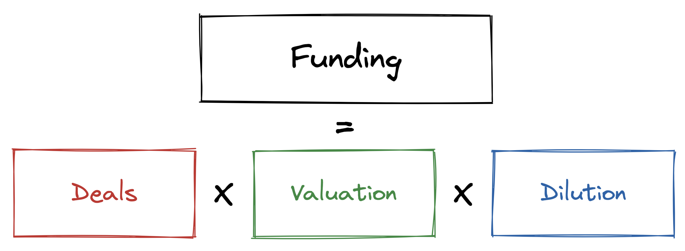
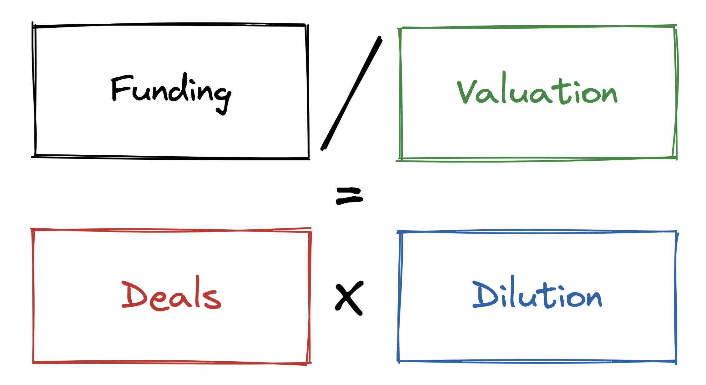
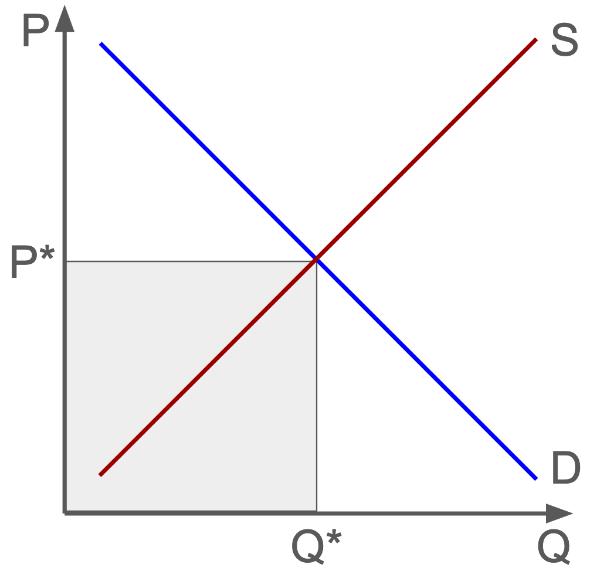
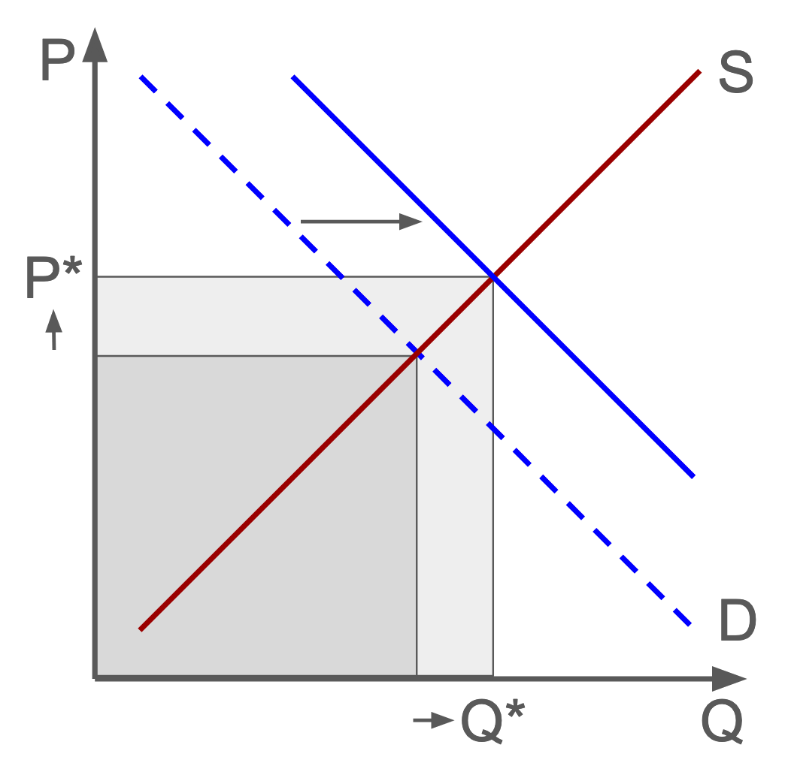
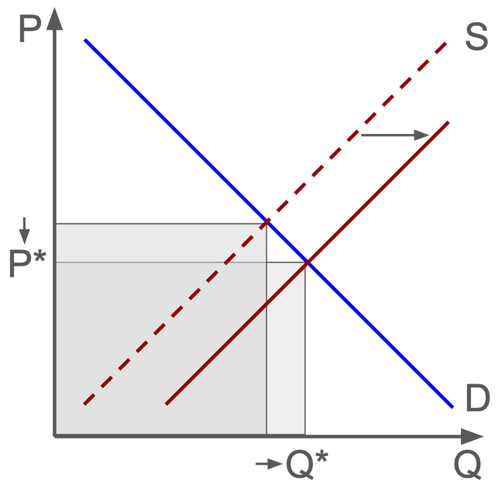

```{r, echo=FALSE, message=FALSE}
# Setting knitr options
knitr::opts_chunk$set(
  warning=FALSE, 
  message=FALSE, 
  echo=FALSE, 
  dev="cairo_pdf", 
  fig.align="center", 
  fig.dim=c(6, 2.75)
)
```

```{r, include=FALSE}
# Imports
library(fastverse)
library(readxl)
library(fixest)
library(ggplot2)
library(hrbrthemes)
library(roll)
library(zoo)
library(fredr)
library(dplyr)
```

```{r, include=FALSE}
# Custom theme for plots
theme_preso <- theme_minimal(base_family="Fira Sans") +
  theme(
      plot.title = element_text(face="bold", margin=margin(0, 0, 5, 0)),
      plot.subtitle = element_text(face="bold"),
      legend.margin = margin(t = -10),
      panel.spacing.x = unit(1, "lines"),
      panel.spacing.y = unit(0.5, "lines"),
      plot.margin = margin(15, 10, 0, 0),
      legend.position = "bottom",
      legend.title = element_blank(),
      axis.title = element_text(size = 10),
      panel.grid.minor.x = element_blank(),
      panel.grid.minor.y = element_blank(),
      panel.grid.major.x = element_blank()
    )
```

```{r, include=FALSE}
# PitchBook search: https://my.pitchbook.com/?pcc=751166-47
data <- data.table(read_excel("Pitchbookv3.xlsx", 1))

# Data cleaning / formatting
setnames(data, c("Year", "Quarter", "Series", "Deal Count", "Capital Invested", "Post Valuation Mean"), c("year", "quarter", "series", "deals", "capital", "valuation"))
data <- data[year != "All"]
data <- data[quarter != "All"]
data <- data[!series %in% c("All", "Series H", "Series I", "Series J", "Series K")]
data[, valuation := as.numeric(valuation) * deals]
data <- na.omit(data)
data[series %in% c("Series D", "Series E", "Series F", "Series G"), series := "Series D+"]
data <- data[, lapply(.SD, sum), .SDcols = c("deals", "capital", "valuation"), by = .(year, quarter, series)]
data[, dilution  := capital / valuation]
data[, valuation := valuation / deals]
setorder(data, year, quarter, series)
data[, year      := as.numeric(year)]
data[, period := paste(year, quarter)]
mod_cols = c("deals", "capital", "valuation", "dilution")
data[, paste0(mod_cols, "_l") := lapply(.SD, log), .SDcols = mod_cols]
data[, paste0(mod_cols, "_ld") := lapply(.SD, \(x) log(x) - log(shift(x, 1))), .SDcols = mod_cols, by = .(series)]
data[, paste0(mod_cols, "_ldl") := lapply(.SD, \(x) log(x) - log(first(x))), .SDcols = mod_cols, by = .(series)]
data[, deals_adj_l := deals_l + dilution_l]
data[, paste0(c("deals_adj_l"), "_ld") := lapply(.SD, \(x) x - shift(x, 1)), .SDcols = c("deals_adj_l"), by = .(series)]
data[, capital_adj := capital / valuation]
data[, capital_adj_g := capital_adj / first(capital_adj) - 1, by = series]
data[, capital_adj_ldl := log(capital_adj / first(capital_adj)), by = series]
data[, time := as.Date(as.yearqtr(period, "%Y %q"))]
data[, check := capital_l - deals_l - valuation_l - dilution_l]

# Pull GDP and Nasdaq data from Federal Reserve
gdp = fredr(
  series_id = "GDP",
  observation_start = as.Date("2010-03-31"),
  observation_end = as.Date("2022-12-31"),
  frequency = "q"
)$value

nasdaq = fredr(
  series_id = "NASDAQCOM",
  observation_start = as.Date("2010-03-31"),
  observation_end = as.Date("2022-12-31"),
  frequency = "q"
)$value

data[, gdp := gdp, by = series]
data[, gdp_l := log(gdp), by = series]
data[, gdp_ld := gdp_l - shift(gdp_l, 1), by = series]

data[, nasdaq := nasdaq, by = series]
data[, nasdaq_l := log(nasdaq), by = series]
data[, nasdaq_ld := nasdaq_l - shift(nasdaq_l, 1), by = series]
```

```{r, include=FALSE}
# Detrend using Hamilton Filter
data[, deals_l_c := c(rep(NA, 8), residuals(feols(deals_l ~ l(deals_l, 5:8), .SD, panel.id = ~series + time))), .SDcols = c("series", "time", "deals_l", "valuation_l"), by = series]
data[, valuation_l_c := c(rep(NA, 8), residuals(feols(valuation_l ~ l(valuation_l, 5:8), .SD, panel.id = ~series + time))), .SDcols = c("series", "time", "deals_l", "valuation_l"), by = series]

data[, deals_l_c_u := deals_l_c, by = series]
data[, valuation_l_c_u := valuation_l_c, by = series]

# Standardize detrended data
data[, deals_l_c := scale(deals_l_c), by = series]
data[, valuation_l_c := scale(valuation_l_c), by = series]
```

```{r, include=FALSE}
# Calculate rolling correlations
data[, cor(na.omit(deals_l_c), na.omit(valuation_l_c)), by = series]
data[,
     deals_valuation_roll_cor := c(
       rep(NA, 8), 
       roll_cor(
         na.omit(deals_l_c_u), 
         na.omit(valuation_l_c_u), 
         width = 12
       )
     ),
     by = series
 ]
```

```{r, include=FALSE}
# Assign quarters to demand or supply based on whether deal activity and valuations co-move in the quarter
demand_e = data[, cumsum(na.omit((sign(valuation_ld) == sign(deals_ld)) * deals_ld)), by = series]
supply_e = data[, cumsum(na.omit((sign(valuation_ld) != sign(deals_ld)) * deals_ld)), by = series]
effects_deals = data.table(date = data[paste(year, quarter) != "2010 1Q", c(time), by = series]$V1, series = demand_e$series, demand_e = demand_e$V1, supply_e = supply_e$V1)
setorder(effects_deals, series, date)
effects_deals <- melt(effects_deals, measure = patterns("_e"))

demand_e = data[, cumsum(na.omit((sign(valuation_ld) == sign(deals_ld)) * valuation_ld)), by = series]
supply_e = data[, cumsum(na.omit((sign(valuation_ld) != sign(deals_ld)) * valuation_ld)), by = series]
effects_valuation = data.table(date = data[paste(year, quarter) != "2010 1Q", c(time), by = series]$V1, series = demand_e$series, demand_e = demand_e$V1, supply_e = supply_e$V1)
setorder(effects_valuation, series, date)
effects_valuation <- melt(effects_valuation, measure = patterns("_e"))

effects_deals[variable == "demand_e", variable := "Demand"]
effects_deals[variable == "supply_e", variable := "Supply"]
effects_valuation[variable == "demand_e", variable := "Demand"]
effects_valuation[variable == "supply_e", variable := "Supply"]
```

```{r, include=FALSE}
# Aggregate data annually
mod_cols_2 <- c("deals", "capital", "valuation", "dilution", "gdp", "capital_adj")

data_yr <- data[, c("series", "year", "deals", "capital", "valuation", "dilution", "gdp", "capital_adj")]

data_yr <- data_yr[, lapply(.SD, \(x) log(sum(x))), .SDcols = mod_cols_2, by = .(series, year)]

data_yr <- data_yr[, paste0(mod_cols_2, "_ldl") := lapply(.SD, \(x) x - first(x)), .SDcols = mod_cols_2, by = .(series)]
```

# Introduction

## Introduction

* Key question: **What drove the explosive growth in venture activity?**

* **Two possible drivers:** \tikz[tstyle]{\node[nstyle](node2){investor exuberance}} and \tikz[tstyle]{\node[nstyle](node3){founder fervor}}
  - Did investors become substantially more favorable toward private startups?
  - Or, did we all become much more entrepreneurial?
  
* **Common narrative:** the bonanza in venture activity over the last decade reflects growing entrepreneurialism, the ease of starting a company, etc.
  - **Spoiler alert:** *not really*
  
\begin{tikzpicture}[tpstyle]
	\draw[pencil,very thick] ([yshift=-2pt]node2.south west) to ([yshift=-2pt]node2.south east);
	\draw[pencil,very thick,brick] ([yshift=-2pt]node3.south west) to ([yshift=-2pt]node3.south east);		
\end{tikzpicture}

## Introduction (Cont'd)

* **Source:** PitchBook data, 2010-2022

* **Note:** Since we're focused on growth, most data is in logarithms

* All analysis done in **R**, code and data can be found here:

\vspace{0.4in}
\begin{center}
	\begin{minipage}{.57\textwidth}
		\NB{\href{https://github.com/whoisnnamdi/startups-preso}{https://github.com/whoisnnamdi/startups-preso}}
	\end{minipage}
\end{center}

# Up and to the Right

## A Rising Tide Lifts All Stages

* From 2010, venture funding grew at ~25% CAGR through the 2011 peak

```{r}
ggplot(data_yr, aes(year, capital_ldl)) +
  geom_line(aes(color = series)) +
  labs(
    title    = "Growth in Funding Volume",
    x        = element_blank(),
    y        = "Cumulative Log Growth"
  ) +
  scale_x_continuous(
    breaks   = seq(2010, 2022, 1),
    expand   = c(0,0)
  ) +
  scale_y_continuous(
    breaks = seq(0, 3, 0.5),
    expand   = c(0,0)
  ) +
  theme_preso +
  theme(
  )
```

## Some Quick Algebra

* Can think about \$1 of invested capital as having \hlight{\textbf{three components}}
  - \# of deals
  - \$ average valuation
  - \% average dilution

```{r, out.width="80%"}

```

## Planting the Seeds

* Deal counts have ballooned across all stages, but the Seed stage stands out

```{r}
ggplot(data_yr, aes(year, deals_ldl)) +
  geom_line(aes(color = series)) +
  labs(
    title    = "Growth in Deal Activity",
    x        = element_blank(),
    y        = "Cumulative Log Growth"
  ) +
  scale_x_continuous(
    breaks   = seq(2010, 2022, 1),
    expand   = c(0,0)
  ) +
  scale_y_continuous(
    limits = c(-0.1, 2.5),
    breaks = seq(0, 2.5, 0.5),
    expand   = c(0,0)
  ) +
  theme_preso +
  theme(
  )
```

## Too Real

* Venture deal activity is anchored to the broader economy, especially at the late-stage

```{r}
ggplot(data_yr) +
  geom_line(aes(x = year, y = deals_ldl, color = "Deals")) +
  geom_line(aes(x = year, y = gdp_ldl, color = "US Real GDP")) +
  facet_wrap(~series, scales = "free") +
  scale_x_continuous(
    breaks   = seq(2010, 2022, 4),
    expand   = c(0,0)
  ) +
  scale_y_continuous(
    limits = c(-0.5, 2.5)
  ) +
  scale_color_discrete(
    labels = c("Deals", "US Real GDP")
  ) +
  labs(
    title = "Growth in Quarterly Deal Count vs US GDP",
    x = NULL,
    y = "Cumulative Log Growth"
  ) +
  theme_preso +
  theme(
    legend.position = c(0.85, 0.25)
  )
```

## Valuation Inflation

* Valuations have grown dramatically across all stages

```{r}
ggplot(data_yr, aes(year, valuation_ldl)) +
  geom_line(aes(color = series)) +
  labs(
    title    = "Growth in Average Deal Valuation",
    x        = element_blank(),
    y        = "Cumulative Log Growth"
  ) +
  scale_x_continuous(
    breaks   = seq(2010, 2022, 1),
    expand   = c(0,0)
  ) +
  scale_y_continuous(
    breaks = seq(0, 3, 0.5),
    expand   = c(0,0)
  ) +
  theme_preso +
  theme(
  )
```

## Tracking the Nasdaq

* Private valuations closely track prices in the public tech market
  - Importantly, this holds true even though different companies raise capital each quarter

```{r, fig.dim=c(6, 2.5)}
ggplot(data[, lapply(.SD, \(x) x - first(x)), .SDcol = c("nasdaq_l", "valuation_l"), by = .(series)]) +
  geom_line(aes(x = data[, time, by = series]$time, y = nasdaq_l, color = "B")) +
  geom_line(aes(x = data[, time, by = series]$time, y = valuation_l, color = "A")) +
  facet_wrap(~series, scales = "free") +
  scale_y_continuous(
    limits = c(-0.5, 3.5)
  ) +
  scale_color_discrete(
    labels = c("Private Valuations", "Nasdaq")
  ) +
  labs(
    title = "Private Valuations vs. The Nasdaq Composite Index",
    x = NULL,
    y = "Cumulative Log Growth"
  ) +
  theme_preso +
  theme(
    legend.position = c(0.85, 0.25),
  )
```


## The Evolution of Dilution

* Dilution has fallen in every stage since 2010

```{r, echo=FALSE, fig.align="center", fig.dim=c(6, 2.75), dev="cairo_pdf"}
ggplot(data_yr, aes(year, dilution_ldl)) +
  geom_line(aes(color = series)) +
  labs(
    title    = "Change in Average Dilution",
    x        = element_blank(),
    y        = "Cumulative Log Growth"
  ) +
  scale_x_continuous(
    breaks   = seq(2010, 2022, 1),
    expand   = c(0,0)
  ) +
  scale_y_continuous(
    expand   = c(0,0)
  ) +
  theme_preso +
  theme(
  )
```

## It's Valuations (Almost) All the Way Down

* Rising valuations drove most funding growth across stages

```{r}
ggplot(melt(data_yr[, c("year", "series", "deals_ldl", "valuation_ldl", "dilution_ldl")], measure = patterns("_ldl")), aes(x = year, y = value, fill = variable)) +
  geom_bar(position = "stack", stat = "identity", width = 0.85, size = 0) +
  facet_wrap(~series, scales = "free") +
  scale_x_continuous(
    breaks   = seq(2010, 2022, 4),
    expand   = c(0,0)
  ) +
  scale_y_continuous(
    breaks = seq(-1, 4, 1),
    limits = c(-1, 4),
    expand = c(0,0)
  ) +
  scale_fill_discrete(
    labels = c("Deals", "Valuation", "Dilution")
  ) +
  labs(
    title    = "Funding Growth Decomposition",
    x        = element_blank(),
    y        = "Cumulative Log Growth"
  ) +
  coord_cartesian(ylim = c(-1, 4)) +
  theme_preso +
  theme(
    legend.position = c(0.85, 0.25)
  )
```

## Algebra II

* "Price adjust" venture funding: \tikz[tstyle]{\node[nstyle](node2){\textbf{divide by valuation}}}
  - Analogous to adjusting nominal GDP with inflation to get real GDP

```{r, out.width="70%"}

```

\begin{tikzpicture}[tpstyle]
	\draw[pencil,very thick] ([yshift=-2pt]node2.south west) to ([yshift=-2pt]node2.south east);			
\end{tikzpicture}

## \"Real\" Funding Growth is Slower Than You Think

* A decade of \tikz[tstyle]{\node[nstyle](node2){zero real growth}} in late-stage funding activity until the bonanza of 2021

```{r}
ggplot(melt(data_yr[, c("year", "series", "capital_ldl", "capital_adj_ldl")], measure = patterns("_ldl")), aes(x = year, y = value, fill = variable)) +
  geom_line(aes(color = variable)) +
  facet_wrap(~series, scales = "free") +
  scale_x_continuous(
    breaks   = seq(2010, 2022, 4),
    expand   = c(0,0)
  ) +
  scale_y_continuous(
    breaks = seq(-1, 4, 1),
    limits = c(-1, 4),
    expand = c(0,0)
  ) +
  scale_color_discrete(
    labels = c("Funding Volume", "Adj. Funding Volume")
  ) +
  labs(
    title    = "Growth in Raw vs Valuation-Adjusted Funding Volume",
    x        = element_blank(),
    y        = "Cumulative Log Growth"
  ) +
  coord_cartesian(ylim = c(-1, 3)) +
  theme_preso +
  theme(
    legend.position = c(0.85, 0.25),
  )
```

\begin{tikzpicture}[tpstyle]
	\draw[pencil,very thick] ([yshift=-2pt]node2.south west) to ([yshift=-2pt]node2.south east);			
\end{tikzpicture}

# The Great Venture Recession

## The Comedown

* Deal activity is \tikz[tstyle]{\node[nstyle](node2){down 50-70\%}} from its all-time high

```{r}
ggplot(data[time >= as.Date("2020-06-30"), lapply(.SD, \(x) x / max(x) - 1), .SDcol = c("nasdaq", "deals"), by = .(series)]) +
  geom_line(aes(x = data[time >= as.Date("2020-06-30"), time, by = series]$time, y = nasdaq, color = "Nasdaq")) +
  geom_line(aes(x = data[time >= as.Date("2020-06-30"), time, by = series]$time, y = deals, color = "tbd")) +
  facet_wrap(~series, scales = "free") +
  scale_x_date(
    date_labels = "%Y",
    date_breaks = "1 year"
  ) +
  scale_y_continuous(
    labels = scales::percent_format(scale = 100),
    limits = c(-0.8, 0)
  ) +
  scale_color_discrete(
    labels = c("Nasdaq", "Deal Count")
  ) +
  labs(
    title = "Deal Activity Relative to Peak",
    x = NULL,
    y = "Relative to Peak"
  ) +
  theme_preso +
  theme(
    legend.position = c(0.85, 0.25),
  )
```

\begin{tikzpicture}[tpstyle]
	\draw[pencil,very thick] ([yshift=-2pt]node2.south west) to ([yshift=-2pt]node2.south east);			
\end{tikzpicture}

## Descent from the Peak

* Private valuations are \tikz[tstyle]{\node[nstyle](node2){down 30-60\%}} from their peak

```{r}
ggplot(data[time >= as.Date("2020-06-30"), lapply(.SD, \(x) x / max(x) - 1), .SDcol = c("nasdaq", "valuation"), by = .(series)]) +
  geom_line(aes(x = data[time >= as.Date("2020-06-30"), time, by = series]$time, y = nasdaq, color = "Nasdaq")) +
  geom_line(aes(x = data[time >= as.Date("2020-06-30"), time, by = series]$time, y = valuation, color = "Valuation")) +
  facet_wrap(~series, scales = "free") +
  scale_x_date(
    date_labels = "%Y",
    date_breaks = "1 year"
  ) +
  scale_y_continuous(
    labels = scales::percent_format(scale = 100),
    limits = c(-0.65, 0)
  ) +
  scale_color_discrete(
    labels = c("Nasdaq", "Private Valuations")
  ) +
  labs(
    title = "Valuations Relative to Peak",
    x = NULL,
    y = "Relative to Peak"
  ) +
  theme_preso +
  theme(
    legend.position = c(0.85, 0.25),
  )
```

\begin{tikzpicture}[tpstyle]
	\draw[pencil,very thick] ([yshift=-2pt]node2.south west) to ([yshift=-2pt]node2.south east);			
\end{tikzpicture}

## The Path to Recovery

* Deal activity and valuations decline for 3-5 Quarters, **2-3 years for full recovery**

```{r, include=FALSE}
endog = data
endog[, paste0(mod_cols, "_ms") := lapply(.SD, \(x) mean(x, na.rm = TRUE)), .SDcols = c("valuation_ld", "deals_ld"), by = series]
endog[, paste0(mod_cols, "_mt") := lapply(.SD, \(x) mean(x, na.rm = TRUE)), .SDcols = c("valuation_ld", "deals_ld"), by = series]
endog[, valuation_ld := valuation_ld - valuation_ms - valuation_mt]
endog[, deals_ld := deals_ld - deals_ms - deals_mt]

ir.v = -cumsum(coef(feols(f(valuation_ld, 0:12) ~ l(deals_ld, 1:4) + l(valuation_ld, 1:4) + l(nasdaq_ld, 0:4), endog, panel.id = ~series + time))[, "nasdaq_ld"])
ir.d = -cumsum(coef(feols(f(deals_ld, 0:12) ~ l(deals_ld, 1:4) + l(valuation_ld, 1:4) + l(nasdaq_ld, 0:4), endog, panel.id = ~series + time))[, "nasdaq_ld"])
```

```{r}
ggplot() +
  geom_smooth(aes(x = time(ir.v) - 1, y = ir.v, color = "b"), se = FALSE) +
  geom_smooth(aes(x = time(ir.d) - 1, y = ir.d, color = "a"), se = FALSE) +
  scale_x_continuous(
    breaks = seq(0, 12, 2)
  ) +
  scale_y_continuous(
    labels = scales::percent_format(scale = 1),
    breaks = seq(-3, 2, 1),
    limits = c(-3, 2)
  ) +
  scale_color_discrete(
    labels = c("Deal Count", "Private Valuations")
  ) +
  labs(
    title = "Path of Deal Activity and Valuations After 1% Fall in the Nasdaq",
    x = "Quarters From Nasdaq Decline",
    y = "% Impact of 1% Decline in Nasdaq"
  ) +
  theme_preso +
  theme(
    legend.position = c(0.17,0.85),
  )
```

# Attribution

## Economics 101

* A simple but powerful model: \tikz[tstyle]{\node[nstyle](node2){\textbf{supply and demand}}}
  - **Demand:** When everyone wants to buy the same thing, quantities and prices both rise
  - **Supply:** When everyone wants to sell the same thing, quantities rise but prices fall

```{r fig.show = "hold", out.width = "30%"}



```

\begin{tikzpicture}[tpstyle]
	\draw[pencil,very thick] ([yshift=-2pt]node2.south west) to ([yshift=-2pt]node2.south east);			
\end{tikzpicture}

## Two Peas in a Pod?

* Deal activity and valuations grow together
  - \tikz[tstyle]{\node[nstyle](node2){\textbf{Warning:}}} This doesn't necessarily mean much
  - Need to detrend both variables first, otherwise correlations are meaningless

```{r, fig.dim=c(6, 2.35)}
ggplot(data[, lapply(.SD, \(x) x - mean(x)), .SDcol = c("deals_l", "valuation_l"), by = series], aes(deals_l, valuation_l)) +
  geom_point(aes(color = series), size = 0.5) +
  geom_smooth(
    aes(color = series),
    method = "lm",
    se = FALSE,
    size = 0.75,
    fullrange = TRUE
  ) +
  facet_wrap(~series, scales = "free") +
  scale_x_continuous(
    limits = c(-2, 2)
  ) +
  scale_y_continuous(
    limits = c(-2, 2)
  ) +
  labs(
    title = "Deal Count vs Valuation",
    x = "Log Deal Count vs. Mean",
    y = "Log Valuation vs. Mean"
  ) +
  theme_preso +
  theme(
    legend.position = "none",
  )
```

\begin{tikzpicture}[tpstyle]
	\draw[pencil,very thick] ([yshift=-2pt]node2.south west) to ([yshift=-2pt]node2.south east);			
\end{tikzpicture}

## Bucking the Trend

* Deal activity and valuations fluctuate together, suggesting demand matters most

```{r}
ggplot(na.omit(data[, .(series, time, deals_l_c, valuation_l_c)])) +
  geom_smooth(aes(x = time, y = deals_l_c, color = "Deals"), se = FALSE, span = 0.2) +
  geom_smooth(aes(x = time, y = valuation_l_c, color = "Valuation"), se = FALSE, span = 0.2) +
  facet_wrap(~series, scale = "free") +
  scale_y_continuous(
    limits = c(-3, 3),
    expand = c(0, 0)
  ) +
  scale_color_discrete(
    labels = c("Deals", "Valuation")
  ) +
  labs(
    title = "Deal Activity and Valuations Relative to Trend",
    x = NULL,
    y = "Std. Dev. Above / Below Trend"
  ) +
  theme_preso + 
  theme(
    legend.position = c(0.85, 0.25)
  )
```

## Correlation Implies Inflation

* Across most stages, financing activity and valuations are positively correlated

```{r}
ggplot(na.omit(data[, .(series, time, deals_valuation_roll_cor)])) +
  geom_line(aes(x = time, y = deals_valuation_roll_cor, color = series)) +
  facet_wrap(~series, scale = "free") +
  scale_y_continuous(
    limits = c(-1, 1)
  ) +
  labs(
    title = "Correlation Over Time Between Deal Count and Valuation",
    x = NULL,
    y = "3Y Rolling Correlation"
  ) +
  theme_preso + 
  theme(
    legend.position = "none"
  )
```

## Supply and Demand

* Can we explain the last decade of venture growth in terms of supply and demand?
  - When demand changes, quantities and prices \tikz[tstyle]{\node[nstyle](node2){move together}}
  - When supply shifts, quantities and prices \tikz[tstyle]{\node[nstyle](node3){move in opposite directions}}

* Attribute growth each quarter to demand or supply depending on how deal activity and valuations co-move; cumulate to get the full historical decomposition

```{r fig.show = "hold", out.width = "25%"}


```

\begin{tikzpicture}[tpstyle]
	\draw[pencil,very thick] ([yshift=-2pt]node2.south west) to ([yshift=-2pt]node2.south east);
	\draw[pencil,very thick,brick] ([yshift=-2pt]node3.south west) to ([yshift=-2pt]node3.south east);
\end{tikzpicture}

## We Don't Have Nearly Enough Startups

* Demand accounts for majority of growth in deal activity

```{r}
ggplot(effects_deals, aes(fill = variable, y = value, x = date)) +
  geom_area(position = "stack", aes(color = variable)) +
  facet_wrap(~series, scales = "free") + 
  scale_x_date(
    expand = c(0, 0),
    date_labels = "%Y",
    date_breaks = "2 years"
  ) +
  scale_y_continuous(
    limits = c(-1.25, 2.5)
  ) +
  labs(
    title = "Growth Decomposition of Deal Activity",
    x = NULL,
    y = "Cumulative Log Growth"
  ) +
  theme_preso +
  theme(
    legend.position = c(0.85, 0.25),
  )
```

## We Value Your Business

* Demand drove most of the increase in venture valuations

```{r}
ggplot(effects_valuation, aes(fill = variable, y = value, x = date)) +
  geom_area(position = "stack", aes(color = variable)) +
  facet_wrap(~series, scales = "free") + 
  scale_x_date(
    expand = c(0, 0),
    date_labels = "%Y",
    date_breaks = "2 years"
  ) +
  scale_y_continuous(
    limits = c(-1, 3.5)
  ) +
  labs(
    title = "Growth Decomposition of Valuations",
    x = NULL,
    y = "Cumulative Log Growth"
  ) +
  theme_preso +
  theme(
    legend.position = c(0.85, 0.25),
  )
```

# Conclusion

## Conclusion

* Surging investor demand for the venture asset class drove the increase in deal activity and valuations over the last decade

* More startups than ever before, but this seems to be a **reaction to cheap and plentiful capital** rather than attractive market opportunities
  - Ideally, venture activity should reflect growing capacity and ability of entrepreneurs to start successful new businesses
  - If venture activity merely reflects investors needing increasingly speculative places to park money, we have a big problem

* The demand side got a bit ahead of itself; \tikz[tstyle]{\node[nstyle](node2){it's time for the supply side to catch up}}

\begin{tikzpicture}[tpstyle]
	\draw[pencil,very thick] ([yshift=-2pt]node2.south west) to ([yshift=-2pt]node2.south east);
\end{tikzpicture}